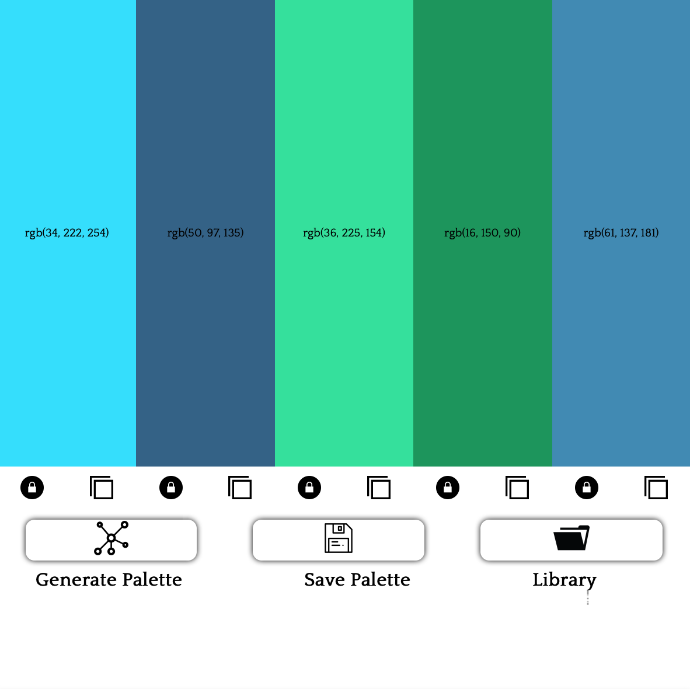
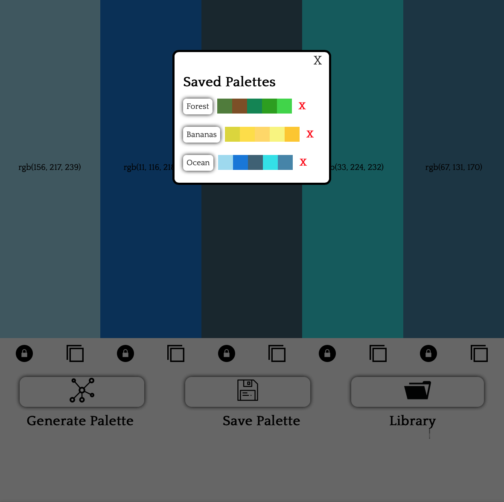

# Color-Palette-Generator

[View It Here](https://salarc123.github.io/Color-Palette-Generator/)

## What is this?
This is a web app for generating and saving randomized color palettes of five colors to assist brands in finding the perfect color scheme

## Features 
• Generate colors with one click  
• Save your palettes to a library  
• Delete palettes in the library  
• Copy colors to clipboard  
• Lock in desirable colors  
• Local Storage Support (Saved palettes will not go on refresh)
